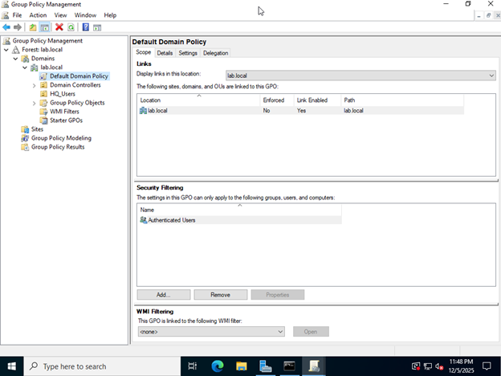
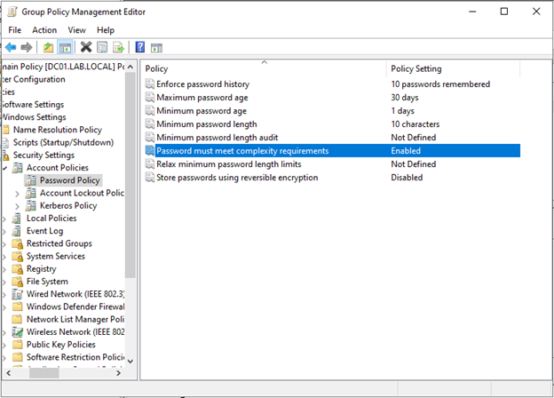
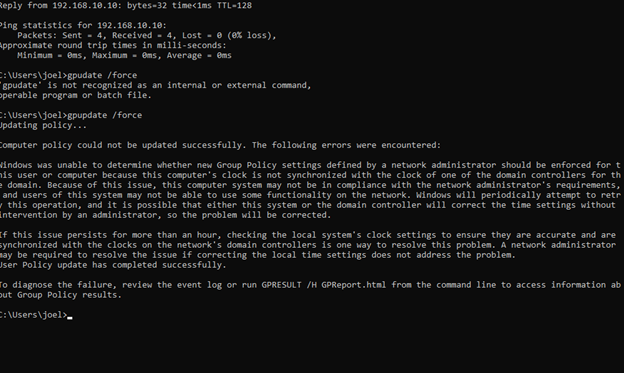
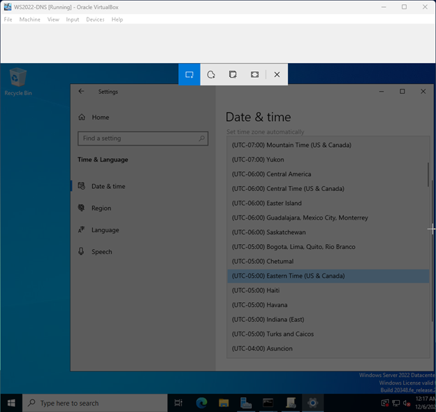
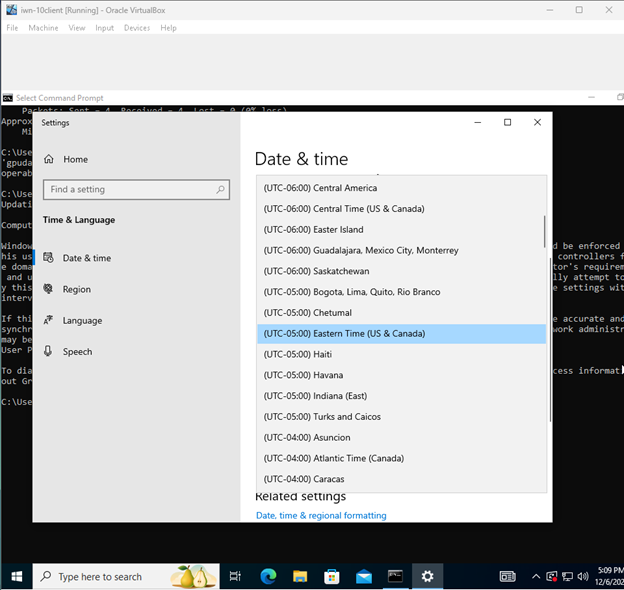
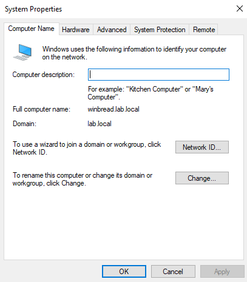
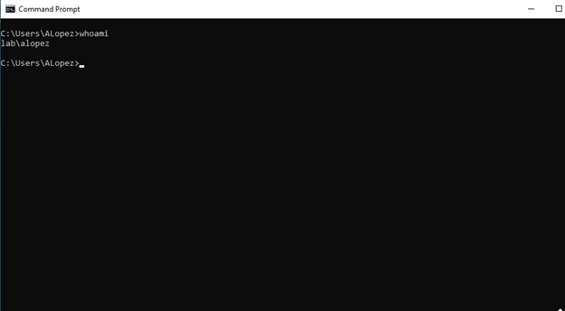
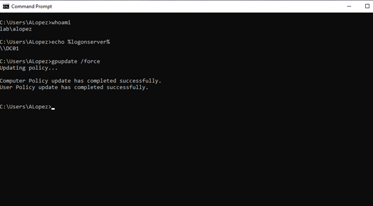
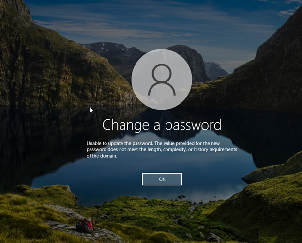

## Part 1 – Enforce Domain Password Policy

### Goal

Use Group Policy to enforce stronger passwords for all domain users in **lab.local**, and verify the policy is actually applied on the Windows 10 client.

---

### 1. Configure password policy in the Default Domain Policy

On **DC01**:

1. Open **Group Policy Management** (`gpmc.msc`).
2. Expand **Forest → Domains → lab.local**.
3. Right-click **Default Domain Policy** → **Edit**.
4. Go to:  
   `Computer Configuration → Policies → Windows Settings → Security Settings → Account Policies → Password Policy`.
5. Configure for example:
   - **Enforce password history**: 5 passwords remembered  
   - **Maximum password age**: 30 days  
   - **Minimum password length**: 8 characters  
   - **Password must meet complexity requirements**: Enabled  

 



  



---          

### 2. Force Group Policy update on DC01

Still on **DC01**, open an elevated Command Prompt and run:

```cmd
gpupdate /force
```
### 3. Force Group Policy update on the Windows 10 client (and troubleshoot)

On the **Windows 10 client**, open **Command Prompt as Administrator** and run:

    gpupdate /force

Initially, this failed with a **time synchronization error**:

> Windows was unable to determine whether new Group Policy settings defined by a network administrator should be enforced for this user or computer because this computer’s clock is not synchronized with the clock of one of the domain controllers for the domain...

 


To fix this and get `gpupdate` working, I did the following:


#### 3.1 Fix time and time zone on DC01

On **DC01**:

- Open **Settings → Time & Language → Date & time**.
- Turn **off** **“Set time automatically”** (the lab has no internet time).
- Set the correct:
  - **Time zone** (e.g. `(UTC-05:00) Eastern Time (US & Canada)`)
  - **Date and time**

  


#### 3.2 Match the Windows 10 client clock to DC01

On the **Windows 10 client**:

- Right-click the clock → **Adjust date/time**.
- Turn **off** “Set time automatically”.
- Set:
  - The **same time zone** as DC01.
  - The **date and time** to match DC01 (within about a minute).

  


---

#### 3.3 Confirm the client is joined to `lab.local`

On the **Windows 10 client**:

- Right-click **This PC** → **Properties** → **Advanced system settings**.
- Go to the **Computer Name** tab.

Here I confirmed:

- **Full computer name:** `winbread.lab.local`  
- **Domain:** `lab.local`

  


#### 3.4 Log in with a domain user and re-run `gpupdate`

I realized I had been using a **local user**, not a domain user, earlier.

On the **Windows 10 client**:

1. Sign out.
2. On the login screen, choose **Other user**.
3. Log in as the domain user, for example:
   - **Username:** `LAB\ALopez`
   - **Password:** (domain password set in AD)

4. Open **Command Prompt** and verify:

```cmd
whoami
echo %logonserver%
```
Output confirms:

- `whoami` → `lab\ALopez`
- `%logonserver%` → `\\DC01`

  


Finally, run:

```cmd
gpupdate /force
```
Now both policies complete successfully:

- `Computer Policy update has completed successfully.`
- `User Policy update has completed successfully.`

  


### 4. Verify password policy enforcement on the client

While logged in as the domain user (`LAB\ALopez`) on the **Windows 10 client**:

1. Press **Ctrl + Alt + Del** → **Change a password**.
2. Try to change the password to a weak value (e.g. `password1` or `12345678`).

Windows shows:

> The value provided for the new password does not meet the length, complexity, or history requirements of the domain.

This confirms the **domain password policy** from the Default Domain Policy is now applied to the client.

  



## Part 2 – Disable Control Panel for Domain Users

**Goal:** Use Group Policy to restrict access to Control Panel and PC settings for users in the `HQ_Users` OU.

### Prerequisites

- `HQ_Users` OU already created in Active Directory.
- At least one domain user account inside `HQ_Users`.
- Windows 10 client joined to `lab.local` and able to log in as an `HQ_Users` user.

---

### Step 1 – Create and Link a GPO to HQ_Users

1. On **DC01**, open **Group Policy Management** (`gpmc.msc`).
2. Expand:

   - **Forest: lab.local**
   - **Domains**
   - **lab.local**
   - **HQ_Users**

3. Right-click **HQ_Users** → **Create a GPO in this domain, and Link it here…**
4. Name the GPO: **`Disable Control Panel - HQ_Users`** → **OK**.

**Screenshot:**  
`04-gpmc-disable-control-panel-gpo.png` – GPMC showing `HQ_Users` selected with the `Disable Control Panel - HQ_Users` GPO linked.

---

### Step 2 – Configure the GPO to Prohibit Access to Control Panel

1. In **Group Policy Management**, right-click  
   **`Disable Control Panel - HQ_Users` → Edit…**
2. In **Group Policy Management Editor**, navigate:

   ```text
   User Configuration
     → Policies
       → Administrative Templates
         → Control Panel
         Double-click **Prohibit access to Control Panel and PC settings**.

Set it to **Enabled** → click **OK**.

**Screenshot:**  
`05-gpo-setting-disable-control-panel.png` – GPO Editor window showing the **Control Panel** node and the **Prohibit access to Control Panel and PC settings** policy set to **Enabled**.

---

### Step 3 – Apply the Policy

**On DC01 (optional):**

```cmd
gpupdate /force
On the Windows 10 client (as an HQ_Users user):

cmd
Copy code
gpupdate /force
```


### Step 4 – Verify Control Panel is Blocked

1. On the **Windows 10 client**, log in as a domain user located in the **HQ_Users** OU.
2. Try to open Control Panel using one of the following methods:
   - Start menu → type **Control Panel** → press **Enter**, or
   - **Win + R** → type `control` → press **Enter**.
3. The attempt should fail with a message similar to:

   > This operation has been canceled due to restrictions in effect on this computer. Please contact your system administrator.

   or Settings/Control Panel will simply refuse to open.

**Screenshot:**  
`06-win10-control-panel-blocked.png` – Windows 10 client showing that access to Control Panel is blocked by Group Policy (restriction error message).


